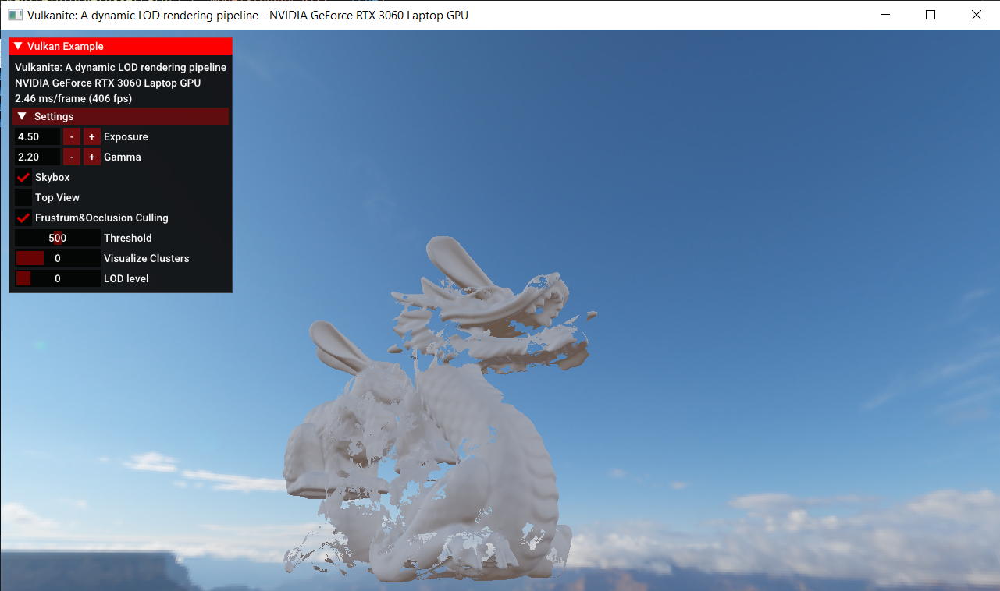

# Vulcanite


### Dependencies
- metis
- assimp
- OpenMesh

### Build

For now, we only test on Windows.

For windows users, we recommend that you use [vcpkg](https://github.com/microsoft/vcpkg) to install dependencies.

If you have successfully installed all dependencies through vcpkg, then this program should be able to run normally. 

TODO: Windows, not using vcpkg
TODO: Linux 

### Features Implemented

- [ ] GPU Driven Depth Culling
- [ ] Nanite Builder
	- [ ] DAG Builder
- [ ] Multiple Instance
- [ ] Mixed-mode Rasterizer


### Performance Analysis


### Miletone Slides

- [Milestone1](https://docs.google.com/presentation/d/1KkI7cfCiym67k_yKQnZ-QDST0Q3UPPoxqMgxU9J9e30/edit?usp=sharing) - GPU-Driven Depth Culling, Clustering & Grouping
- [Milestone2](https://docs.google.com/presentation/d/1YuY-mJDUGPB7RGOcJs3eZZ68J12EXOHgfcvojIDqEDI/edit?usp=sharing) - DAG, Serialization & Deserialization
- [Milestone3](https://docs.google.com/presentation/d/1hUoOy5HGEKSDIVfERBmkov804C9v1XEtksona1Azle4/edit?usp=sharing) - Mixed-mode Rasterizer, Multiple Instance, Performance Analysis

---

**Below are for developers**

### TODOs

- [ ] CPU Side
	- [ ] Mesh simplification
		- [ ] Lock edge on cluster group boundaries
	- [ ] Cluster & Cluster group
		- [ ] Learn about METIS (or other available algorithms for triangle clustering)
		- [ ] Is forming cluster group exactly the same as forming cluster?
	- [ ] Core Algorithm
		Given cluster & cluster group
		- [ ] Mesh simplification (lock boundaries of cluster group)
		- [ ] Re-Cluster
		- [ ] Recalculate cluster groups
		- [ ] Maintain a LOD BVH Tree for each level
	- [ ] Nanite Mesh Exporter
		- [ ] Mesh LOD
		- [ ] BVH Tree
		- [ ] Data Compression
	
- [ ]  GPU Side
	- [ ] Runtime LOD
	
	- [ ] Soft ras
	
	- [ ] Hard ras
	
		- [ ] Mesh shader
	  
	- [ ] Customized depth test
	
	- [ ] Tile based deferred materials
	
	- [ ] Shadowmap culling


### Links

- [A Deep Dive into Nanite Virtualized Geometry - YouTube](https://www.youtube.com/watch?v=eviSykqSUUw)

- [A Macro View of Nanite – The Code Corsair (elopezr.com)](https://www.elopezr.com/a-macro-view-of-nanite/)

- [Mesh_shading_SIG2019.pptx (live.com)](https://view.officeapps.live.com/op/view.aspx?src=https%3A%2F%2Fadvances.realtimerendering.com%2Fs2019%2FMesh_shading_SIG2019.pptx&wdOrigin=BROWSELINK)

- [The Visibility Buffer (jcgt.org)](https://jcgt.org/published/0002/02/04/paper.pdf)

- [Journey to Nanite (highperformancegraphics.org)](https://www.highperformancegraphics.org/slides22/Journey_to_Nanite.pdf)

- [Karis Nanite Talk SIG2021](https://advances.realtimerendering.com/s2021/Karis_Nanite_SIGGRAPH_Advances_2021_final.pdf)

- [GAMES104_Lecture22.pdf (myqcloud.com)](https://games-1312234642.cos.ap-guangzhou.myqcloud.com/course/GAMES104/GAMES104_Lecture22.pdf)


### Log

11.8

> We will not use OpenMesh to load mesh anymore. Consider using assimp.
Two reasons mainly:
1. OpenMesh is too slow.
	- 50 seconds to load `dragon.obj`. 800k faces
	- 6 seonds to load `bunny.obj`. 60k faces
2. If we want to use half-edge data structure, that would require us to maintain this structure after every mesh simplification. Gonna bring a lot of problem.

A better solution
- Use `assimp` to load obj
	- Note: `assimp` is also not very fast when loading meshes.
		- 15 seconds to load `dragon.obj`. 800k faces
		- 1.2 seonds to load `bunny.obj`. 60k faces
- Construct adjacency graph 

11.9

- vkgltf -> OpenMesh -> Clustering -> Cluster Grouping -> Simplification -> Re-clustering -> ... (Until only one cluster group)


11.10

Cluster result visualization
Only test 5 clusters for now
- Incorrect?
	- Why are triangles that are not even adjacent getting assigned into the same cluster??? Is this right?
	- May need to dig deeper into graph partition part...``
	

11.11

This might be because that each parts of teapot are not even connected???


Clustering now works fine with fixed size 32.
Howeve, the size is not fixed and it will fluctuate between 31 ~ 33.
We need to consider **if it will bring more problems**.
It should be solvable without using recursive partition?

---
- Milestone of cluster & cluster group
<table>
    <tr>
        <th>Cluster</th>
        <th>Cluster Group</th>
    </tr>
    <tr>
        <th></th>
        <th></th>
    </tr>
</table>


- Milestone of Dynamic LOD selection (Red: LOD 0 Green: LOD 1 Blue: LOD 2)


- **Limitations**
  - Not fixed size
  - Unconnected mesh


11.12

- TODO
	- [ ] Fix unconnected mesh issues?
		- [ ] How to fix it?
	- [ ] Build the whole cpu part pipeline

Draft version of implementation
```cpp
struct Cluster{
	std::map<int, int> neighborsAndCosts;
	std::vector<uint32_t> triangles;
};

struct ClusterGroup{
	std::map<int, int> neighborsAndCosts;
	std::vector<uint32_t> boundaries;
};

struct Mesh{
	std::vector<Cluster> clusters;
	std::vector<ClusterGroup> clusterGroups;
};

struct NaniteMesh{
	uint32_t lod_nums;
	std::vector<Mesh> meshes;
};
```

11.15
Steps
- [x] Implement `Mesh` class. Generate cluster/cluster group index for lod0
- [x] Implement `Cluster` & `ClusterGroup` class
- [x] Generate cluster/cluster group info for the rest of lods
- [ ] Lock edges
- [ ] Consider refreshing cmd buffer to see clustering of each lod
- [ ] Build DAG/BVH for nanite infos.
	- Before simplification:
	- [ ] We need to store the ~~vertex~~ half-edge handles of boundaries (so that we know which face is inside)
		- [ ] This is based on the assumption that handles will still be valid after simplification
		- [ ] If we find out that handles turn out to be invalid in some cases?
			- [ ] Consider storing an extra attribute that represents the cluster group
	- After simplification:
	- [ ] With all the boundaries, we can now do a simple graph traversal
	- [ ] We need to build triangle graph first for the simplified mesh
		- [ ] Simply use non-recursive BFS
- [ ] Serialize
	- Consider
	- [ ] protobuf (High priority)
	- [ ] boost (Low priority)


11.18
- Bad News: We may use the wrong clustering step.
	- Do clustering within each cluster group.
	- How to do decimation within one cluster group?

11.26

Basic Dynamic LOD

12.1

Multi-instance
- We can use drawIndirect struct to easily implement multi-instance
- However, we need to consider how we should 
- Cluster/culling
- Top view

每个ClusterInfo以及ErrorInfo都需要存多份，同时多份里面分别存一个objectid，但是在Culling时不需要读取这个objectId，
需要搞清楚怎么在compute shader之后创建一个新的buffer作为输出，同时输入到另一个stage里
因为objectId目前只用于获取当前对应的modelMatrix，而ClusterInfo和ErrorInfo都是经过变换的，所以只需要在最后culling输出的时候需要存入这个objectId。
在culling之前，输入一个ObjectId数组，经过culling之后，输出一个新的ObjectId数组，这个数组和后面的三角形一一对应，同时对应着modelMatrices


在culling中，如果我输入了两份的clusterInfo，就会产出一个带有offset的culled indices，同时就算这个indices带有objectId，也很难区分，除非再加一个instance层

每个pipeline
	对于compute pipeline来说
		含有一个pipeline layout，这个pipeline layout含有一个descriptor layout，以及push constant相关的信息。
		一个stage，对应着当前pipeline属于哪个阶段

对于每个着色器
	可能有多个descriptor sets（如果我们需要对不同的物体进行同样流程的绘制，就需要不同的descriptor sets），每个set里面有多个bindings。
	只有一个set layout（可能需要多个？如果当前着色器在一次绘制中用了多个descriptor sets的话）用来告诉当前shader各个


如何解决vs无法访问primitveID的问题？
	1. gs
	2. 额外创建一个compute shader，这个shader需要做到：
		生成一个per-vertex的attribute，这个attribute代表当前的primitveId，然而做不到，因为如果有多个实例的情况下，可能会有一个attribute
		index buffer			: 0 1 2 | 0 1 2 | 5 6 7
		object index buffer		: 0 0 0 | 1 1 1 | 0 0 0
		primtive index buffer 	: 0/1 | 0/1 | 0/1 
		不能在vertex shader里解决这个问题！
		需要后置

		正确的做法应该是：直接将culledIndices和objectIndices合在一起通过computeShader生成一个visibilityBuffer
		如何创建？


12.2 

Multiple mesh 现在的问题：


可能是什么引起的呢？
- 对于dragon来说，它的索引应该是指不到bunny的mesh才对的，而对于bunny来说，它的objectId又更不应该对应dragon的modelMatrix。所以这种情况出现就是违背了前面两个条件的其中一种，但是如果是dragon的索引指向了bunny的vertex，最终出来的兔子耳朵不会这么完整，所以更可能的情况是：bunny的objectId指向了dragon。但是为什么在没有多个mesh的时候就没有出现这个情况呢？


12.3

关于BVH和MPMC，根据slide提供的数据以及GAMES104，感觉目前优先级比较高的应该还是实现BVH，然后考虑怎么在compute shader里面先做最基础的树的遍历，这个最基础的树的遍历应该就可以节省很多性能了，MPMC能够提供的大概有30%的提升。

构建BVH：
	- 还是在CPU侧，需要将children cluster indices留存下来
	- 在GPU侧，如何使多个working thread共享一片内存？
		- 直接访问buffer即可
		- 同时我需要知道当前BVH的大致信息：起码要知道第一层多少个node（第一层指定thread时需要知道），以及知道每一层最多几个node（开辟buffer时需要）
		- 对于同一层的working thread，我需要考虑：当前层数下所有node的parentError（具sig slide所说，只需要parentError，但是我们反正也存了当前节点的lod error），开辟两片buffer，一片buffer为临时的用来存储cluster node的区域，这片区域存储所有临时的应该被遍历的cluster index，另一篇区域存储所有最终将会被送到culling这一步的cluster
	- 为什么GAMES104中说leaf node是以cluster group为单位？

	似乎我对于这个里面的BVH过度理解了，它所说的BVH似乎就是对每个LOD各自都构建一个BVH？
	那么workthread如何判断的呢？
	先判断LOD0，如果

12.4

BVH Traversal

- First we should write something like this

```cpp

VkBuffer allNodeInfos;
VkBuffer currNodeInfoList;
VkBuffer nextNodeInfoList;

VkPipeline bvhTraversePipeline;
VkPipelineLayout bvhTraversePipelineLayout;

1. Create buffer;
2. Create descriptor set & layout with buffer;
3. Create pipeline layout with descriptor layout;
4. Write shader of traversing
	4-a. Before traversing, push virtual node in.
	4-b. Do traversal. Co valid chilren into nextNodeInfoList;
	4-c. Swap currNodeInfoList & nextNodeInfoList. CLEAR currNodeInfoList;
	4-d. 
5. Creaete buffer barrier between traverse and culling;


// We need two descriptor layout? to do swapchain? 
// Or even worse, we might need two pipeline?

struct TraverseJob
{
	uint32_t level;
	uint32_t nodeStart;
	uint32_t nodeCount;
};

void traverseBVH()
{
	for	(i < maxLevel)
	{
		TraverseJob job;
		job.level = i;
		job.nodeStart = 
	}
}

void traverseCurrLevel(TraverseJob & job);

```

12.5
TODO: 看Instance以及NaniteScene，看下是lod层的offset出问题了还是object层的offset出问题了

12.7
检查children index是否出错了

构建compute pipelinee

```cpp
two subpasses


```