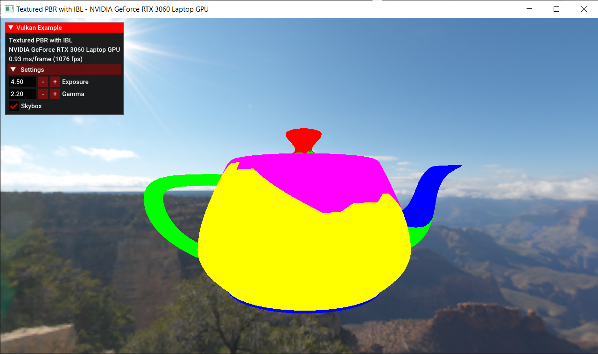
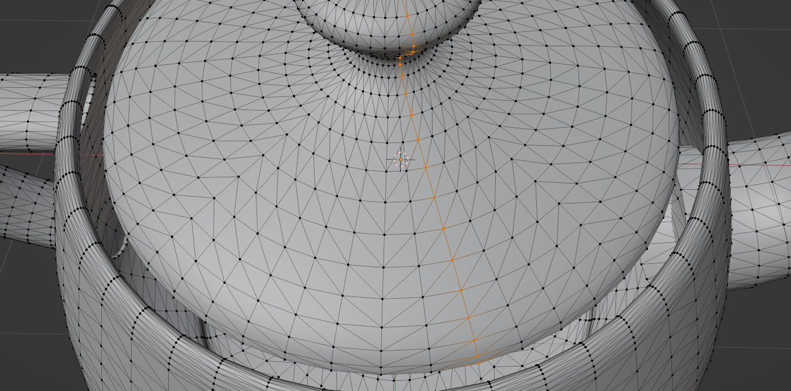
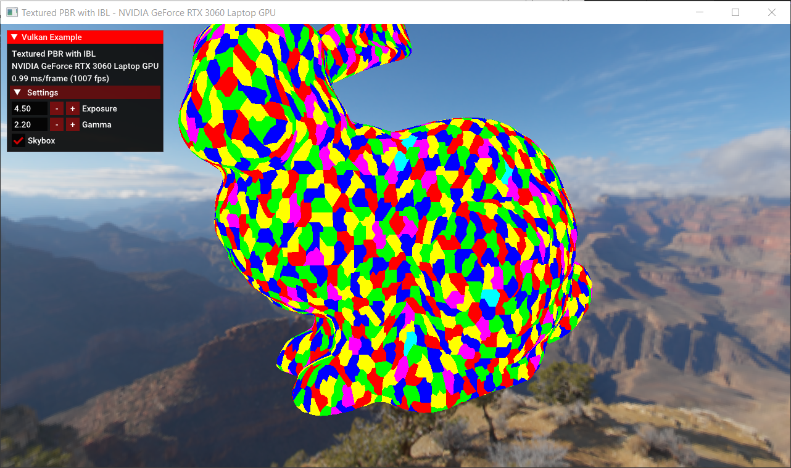
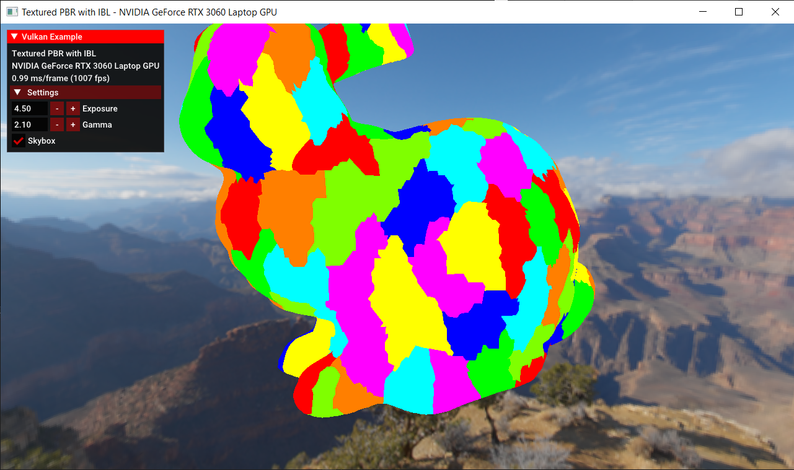
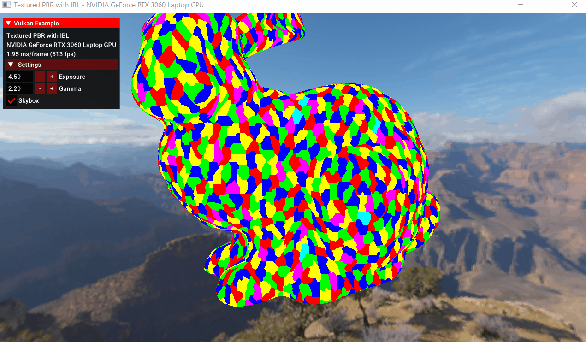

# Vulcanite

### Dependencies
- metis
- assimp
- OpenMesh

### Build

For now, we only test on Windows.

For windows users, we recommend that you use [vcpkg](https://github.com/microsoft/vcpkg) to install dependencies.

If you have successfully installed all dependencies through vcpkg, then this program should be able to run normally. 

TODO: Windows, not using vcpkg

TODO: Linux 

### TODOs

- [ ] CPU Side
	- [ ] Mesh simplification
		- [ ] Lock edge on cluster group boundaries
	- [ ] Cluster & Cluster group
		- [ ] Learn about METIS (or other available algorithms for triangle clustering)
		- [ ] Is forming cluster group exactly the same as forming cluster?
	- [ ] Core Algorithm
		Given cluster & cluster group
		- [ ] Mesh simplification (lock boundaries of cluster group)
		- [ ] Re-Cluster
		- [ ] Recalculate cluster groups
		- [ ] Maintain a LOD BVH Tree for each level
	- [ ] Nanite Mesh Exporter
		- [ ] Mesh LOD
		- [ ] BVH Tree
		- [ ] Data Compression
	
- [ ]  GPU Side
	- [ ] Runtime LOD
	
	- [ ] Soft ras
	
	- [ ] Hard ras
	
		- [ ] Mesh shader
	  
	- [ ] Customized depth test
	
	- [ ] Tile based deferred materials
	
	- [ ] Shadowmap culling


### Links

- [A Deep Dive into Nanite Virtualized Geometry - YouTube](https://www.youtube.com/watch?v=eviSykqSUUw)

- [A Macro View of Nanite – The Code Corsair (elopezr.com)](https://www.elopezr.com/a-macro-view-of-nanite/)

- [Mesh_shading_SIG2019.pptx (live.com)](https://view.officeapps.live.com/op/view.aspx?src=https%3A%2F%2Fadvances.realtimerendering.com%2Fs2019%2FMesh_shading_SIG2019.pptx&wdOrigin=BROWSELINK)

- [The Visibility Buffer (jcgt.org)](https://jcgt.org/published/0002/02/04/paper.pdf)

- [Journey to Nanite (highperformancegraphics.org)](https://www.highperformancegraphics.org/slides22/Journey_to_Nanite.pdf)

- [Karis Nanite Talk SIG2021](https://advances.realtimerendering.com/s2021/Karis_Nanite_SIGGRAPH_Advances_2021_final.pdf)

- [GAMES104_Lecture22.pdf (myqcloud.com)](https://games-1312234642.cos.ap-guangzhou.myqcloud.com/course/GAMES104/GAMES104_Lecture22.pdf)


### Log

11.8

> We will not use OpenMesh to load mesh anymore. Consider using assimp.
Two reasons mainly:
1. OpenMesh is too slow.
	- 50 seconds to load `dragon.obj`. 800k faces
	- 6 seonds to load `bunny.obj`. 60k faces
2. If we want to use half-edge data structure, that would require us to maintain this structure after every mesh simplification. Gonna bring a lot of problem.

A better solution
- Use `assimp` to load obj
	- Note: `assimp` is also not very fast when loading meshes.
		- 15 seconds to load `dragon.obj`. 800k faces
		- 1.2 seonds to load `bunny.obj`. 60k faces
- Construct adjacency graph 

11.9

- vkgltf -> OpenMesh -> Clustering -> Cluster Grouping -> Simplification -> Re-clustering -> ... (Until only one cluster group)


11.10

Cluster result visualization
Only test 5 clusters for now
- Incorrect?
	- Why are triangles that are not even adjacent getting assigned into the same cluster??? Is this right?
	- May need to dig deeper into graph partition part...``
	

11.11

This might be because that each parts of teapot are not even connected???



Clustering now works fine with fixed size 32.
Howeve, the size is not fixed and it will fluctuate between 31 ~ 33.
We need to consider **if it will bring more problems**.
It should be solvable without using recursive partition?

---
- Milestone of cluster & cluster group
<table>
    <tr>
        <th>Cluster</th>
        <th>Cluster Group</th>
    </tr>
    <tr>
        <th></th>
        <th></th>
    </tr>
</table>



- **Limitations**
	- Not fixed size
	- Unconnected mesh


11.12

- TODO
	- [ ] Fix unconnected mesh issues?
		- [ ] How to fix it?
	- [ ] Build the whole cpu part pipeline

Draft version of implementation
```cpp
struct Cluster{
	std::map<int, int> neighborsAndCosts;
	std::vector<uint32_t> triangles;
};

struct ClusterGroup{
	std::map<int, int> neighborsAndCosts;
	std::vector<uint32_t> boundaries;
};

struct Mesh{
	std::vector<Cluster> clusters;
	std::vector<ClusterGroup> clusterGroups;
};

struct NaniteMesh{
	uint32_t lod_nums;
	std::vector<Mesh> meshes;
};
```

11.15
Steps
- [x] Implement `Mesh` class. Generate cluster/cluster group index for lod0
- [x] Implement `Cluster` & `ClusterGroup` class
- [x] Generate cluster/cluster group info for the rest of lods
- [ ] Lock edges
- [ ] Consider refreshing cmd buffer to see clustering of each lod
- [ ] Build DAG/BVH for nanite infos.
	- Before simplification:
	- [ ] We need to store the ~~vertex~~ half-edge handles of boundaries (so that we know which face is inside)
		- [ ] This is based on the assumption that handles will still be valid after simplification
		- [ ] If we find out that handles turn out to be invalid in some cases?
			- [ ] Consider storing an extra attribute that represents the cluster group
	- After simplification:
	- [ ] With all the boundaries, we can now do a simple graph traversal
	- [ ] We need to build triangle graph first for the simplified mesh
		- [ ] Simply use non-recursive BFS
- [ ] Serialize
	- Consider
	- [ ] protobuf (High priority)
	- [ ] boost (Low priority)


11.18
- Bad News: We may use the wrong clustering step.
	- Do clustering within each cluster group.
	- How to do decimation within one cluster group?

11.26

Basic Dynamic LOD


