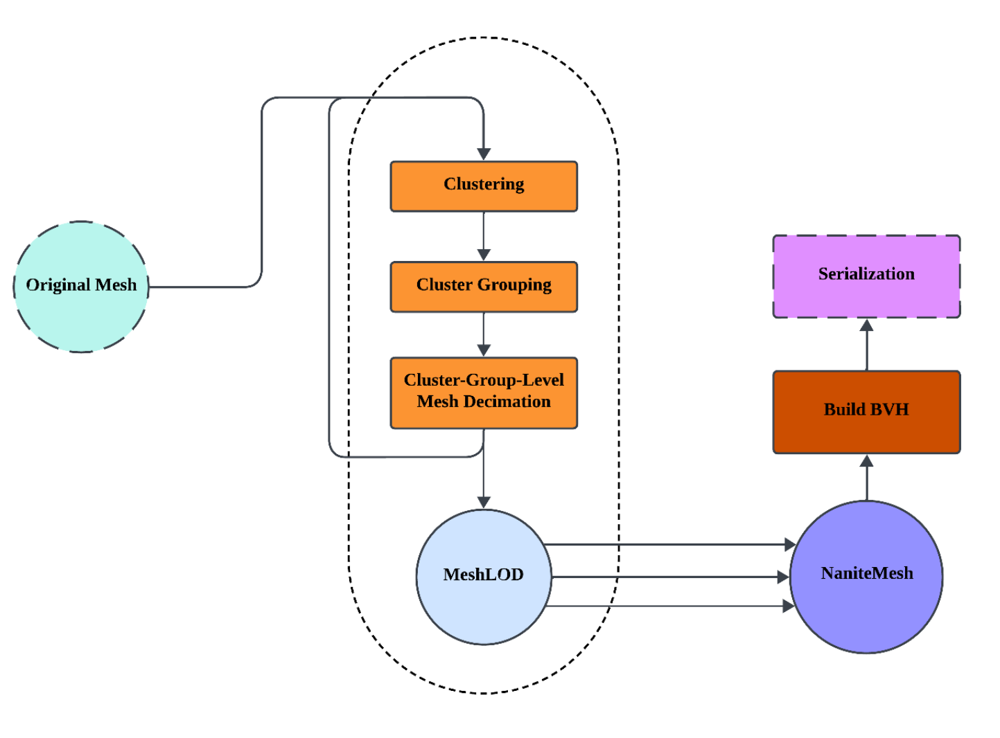
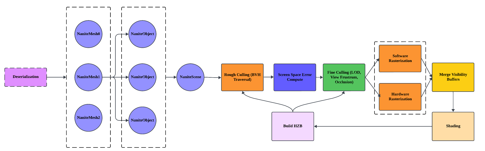

<div style="text-align:center">

## Vulkanite

A Vulkan Implementatioin of Nanite in Unreal Engine 5

</div>

**University of Pennsylvania, [CIS 565: GPU Programming and Architecture, Final Project](https://cis565-fall-2023.github.io/)**


**Han Yang ([LinkedIn]() | [Personal Website]())** and **Yi'an Chen ([LinkedIn](https://www.linkedin.com/in/yian-chen-33a31a1a8/) | [Personal Website](https://sydianandrewchen.github.io/blog/))**

 <!--  -->


### Dependencies
- `metis`
- `OpenMesh`
- `Vulkan`

### Build

For now, we only test on Windows. 

For windows users, we recommend that you use [vcpkg](https://github.com/microsoft/vcpkg) to install dependencies.

If you have successfully installed all dependencies through vcpkg, then this program should be able to run normally. 

We recommend you use a script file like this to build this project:

```
set VCPKG_PATH="C:\vcpkg" ::change this to your own vcpkg directory

for /F %%i in ('dir /b /a ".\build\*"') do (
    echo if you see this the folder is NOT empty
    goto clean_build
)
goto make_build

:clean_build
echo "Cleaning build file"
del build/*
goto start_build

:make_build
echo "Making build directory"
mkdir build
goto start_build

:start_build
echo "Start building"
cd ./build/
cmake .. -DCMAKE_TOOLCHAIN_FILE=%VCPKG_PATH%\scripts\buildsystems\vcpkg.cmake
cd ..
```

### Features Implemented

- [x] GPU Driven View Frustrum Culling and Occlusion Culling
- [x] BVH Cluster Culling
- [x] Nanite Builder
	- [x] DAG Builder
- [x] Multiple Instance
- [x] Visibility Buffer Based rendering
- [x] Mixed-mode Rasterizer

### Overview

This project is deeply inspired by Unreal Engine's Nanite Virtual Geometry System, yet it is primarily developed from the ground up. Echoing Richard Feynman's philosophy, "What I cannot create, I do not understand," our aim is to demystify the core principles of Nanite. We endeavor to provide developers with an independent virtual geometry module, distinct from Unreal Engine, enhancing their understanding and application of these advanced rendering techniques.

#### Basic Idea

The central question we address is how to handle high-polygon-count triangle geometry, especially when numerous triangles shrink to less than one pixel in size after rasterization. Traditional Level of Detail (LOD) methods switch between different mesh resolutions based on the viewer's distance, leading to visual discontinuities during camera movement. Nanite introduces an innovative solution: rather than rendering separate LOD levels, it blends patches from various LODs. This heuristic mixing ensures a seamless and visually coherent output from the current camera perspective.

#### Nanite Mesh Building


To avoid excessive triangle overdraw, it's crucial to establish a hierarchical relationship among patches across different LOD levels, ensuring they cover identical areas. Nanite employs a sophisticated technique to maintain this hierarchy and facilitate smooth transitions: it simplifies triangles within the same cluster group, followed by re-grouping and re-clustering. Here we implemented nanite building pipeline based on `OpenMesh` and `METIS`.



#### Runtime LOD Selection


Using the Quadratic Error Metric (QEM), we can project this error onto the screen space. This projection is facilitated by enclosing each patch within a bounding sphere. We maintain a hierarchy where each parent's error and bounding radius are always greater than those of its children. This hierarchy ensures a monotonic relationship, allowing us to evaluate each patch (whether parent or child) independently.

#### Mixed Rasterization

For large triangles covering numerous pixels, hardware rasterization is highly efficient. Conversely, for smaller triangles — those spanning only a few pixels or slightly more — software rasterization proves to be much faster. In our software rasterization process, we employ a 64-bit texture: the upper 32 bits store depth information, while the lower 32 bits hold visibility buffer data. This approach ensures an effective Z-test during rasterization, optimizing performance for varying triangle sizes.

Here our image layout in software rasterization stage is this:

| Depth | ClusterId | ObjectId | TriangleId |
| ----- | --------- | -------- | ---------- |
| 32    | 15        | 11       | 6          |

Where the lower 32 bits can be used in the shading stage to reconstruct pixel attribute values. A visualization of the visibility buffer is shown as below:


#### Cluster Culling With BVH
The BVH plays a pivotal role in the Nanite pipeline as an acceleration structure, consistent with its historical application. Within Nanite, the BVH serves to speed up cluster culling during subsequent phases. Leveraging its spatial hierarchical structure enables the rapid elimination of numerous clusters that don't necessitate iteration.

Culling operations using BVH closely mirror previous practices, including frustum culling and occlusion culling based on the bounding boxes of BVH nodes. Subsequent to these initial steps, the culling process extends to clusters, incorporating evaluation criteria such as `parentError` and `clusterError`:

```cpp
Render: parentError > threshold && clusterError <= threshold
Cull:   parentError <= threshold || clusterError > threshold
```

The integration of BVH as an acceleration structure facilitates traversing clusters from an entire mesh down to individual small clusters. Consequently, using `parentError <= threshold` as the culling condition efficiently handles all child clusters associated with the current BVH nodes. This means that apart from the bounding box, we also need to store the maximum of `parentNormalizedError` and the largest `parentBoundingSphere`, which are needed to get the highest `parentError`.

This approach of coarse culling allows for the pre-culling of over 80% of clusters within the scene. This optimization yields an average performance increase of around 30%.

#### Nanite Instancing
Instancing is crucial in Nanite for efficiently rendering scenes with over 1 billion triangles, minimizing GPU memory usage by eliminating repeated triangles and vertices. Due to our GPU-driven pipelines, direct modification of `instanceCount` in `vkDrawIndexedIndirect` is challenging. Instancing is implemented in the preparation stage at two levels: 

1. Primitive-Level Instancing: Assigning a unique `objectId` to each cluster removes redundant triangles, allowing for optimal GPU memory usage and rendering scenes with up to **hundreds of millions** of triangles.

2. Cluster-Level Instancing: By assigning an `objectId` from parent BVH nodes, repeated clusters are eliminated. This level of instancing facilitates rendering scenes with over **1 billion** triangles while fully utilizing GPU memory.

#### Rendering Pipeline



Using nanite scene, we can use different approaches to accelerate the rendering process, 

### Known Bugs

Flickering when view is far, this may due to some synchronization issue, but we currently don't know why.

Mesh decimation is not robust enough. For now, it only accepts mesh whose faces are all connected. 

### Performance Analysis

- Cluster-level LOD On/Off
	- Tested on: Windows 10, AMD Ryzen 5800 HS with Radeon Graphics CPU @ 3.20GHz 16GB, NVIDIA GeForce RTX3060 Laptop 8GB


#### NSight GPU Trace 

This trace result is produced on NVidia RTX 4080 laptop GPU.


We can see from the graph that there are two stages that have a high proportion of active SM unused warp slots, the first stage is fine culling stage, the second stage is hardware rasterization stage. And since our code in that two stages doesn't have much divergence, we thought the main reason for unused warp slots are delay from global memory access.

Further investigation proved our guess. As in those shaders that most stalls are caused by a memory load or store.


But due to the randomness of memory access, here we cannot use shared memory to reduce global memory access. A great idea is to do stream compaction on those global array so that the memory access are much more consistent.

- Software Rasterization On/Off
	> Please note that this test is run with runtime cluster-level lod always on, which is why framerate is high even when all optimizations are off.
	- Tested on: Windows 11, i9-12900HX @ 2.30GHz 16GB, RTX4080 laptop 12GB


### Miletone Slides

- [Milestone1](https://docs.google.com/presentation/d/1KkI7cfCiym67k_yKQnZ-QDST0Q3UPPoxqMgxU9J9e30/edit?usp=sharing) - GPU-Driven Depth Culling, Clustering & Grouping
- [Milestone2](https://docs.google.com/presentation/d/1YuY-mJDUGPB7RGOcJs3eZZ68J12EXOHgfcvojIDqEDI/edit?usp=sharing) - DAG, Serialization & Deserialization
- [Milestone3](https://docs.google.com/presentation/d/1hUoOy5HGEKSDIVfERBmkov804C9v1XEtksona1Azle4/edit?usp=sharing) - Mixed-mode Rasterizer, Multiple Instance, Performance Analysis

---

**Below are for developers**

### TODOs

- [x] CPU Side
	- [x] Mesh simplification
		- [x] Lock edge on cluster group boundaries
	- [x] Cluster & Cluster group
		- [x] Learn about METIS (or other available algorithms for triangle clustering)
		- [x] Is forming cluster group exactly the same as forming cluster?
	- [x] Core Algorithm
		Given cluster & cluster group
		- [x] Mesh simplification (lock boundaries of cluster group)
		- [x] Re-Cluster
		- [x] Recalculate cluster groups
		- [x] Maintain a LOD BVH Tree for each level
	- [x] BVH Builder
	- [x] Nanite Mesh Exporter
		- [x] Mesh LOD
		- [ ] Data Compression
	- [ ] Parallel building
	
- [x]  GPU Side
	- [x] Runtime LOD
	
	- [x] Soft ras
	
	- [x] Hard ras
	
		- [x] Mesh shader
	
	- [ ] BVH Traversal
	  	- [x] Naive Traversal
		- [ ] MPMC
	
	- [ ] Customized depth test
	
	- [ ] Tile based deferred materials
	
	- [ ] Shadowmap culling


### Links

- [A Deep Dive into Nanite Virtualized Geometry - YouTube](https://www.youtube.com/watch?v=eviSykqSUUw)

- [A Macro View of Nanite – The Code Corsair (elopezr.com)](https://www.elopezr.com/a-macro-view-of-nanite/)

- [Mesh_shading_SIG2019.pptx (live.com)](https://view.officeapps.live.com/op/view.aspx?src=https%3A%2F%2Fadvances.realtimerendering.com%2Fs2019%2FMesh_shading_SIG2019.pptx&wdOrigin=BROWSELINK)

- [The Visibility Buffer (jcgt.org)](https://jcgt.org/published/0002/02/04/paper.pdf)

- [Journey to Nanite (highperformancegraphics.org)](https://www.highperformancegraphics.org/slides22/Journey_to_Nanite.pdf)

- [Karis Nanite Talk SIG2021](https://advances.realtimerendering.com/s2021/Karis_Nanite_SIGGRAPH_Advances_2021_final.pdf)

- [GAMES104_Lecture22.pdf (myqcloud.com)](https://games-1312234642.cos.ap-guangzhou.myqcloud.com/course/GAMES104/GAMES104_Lecture22.pdf)

